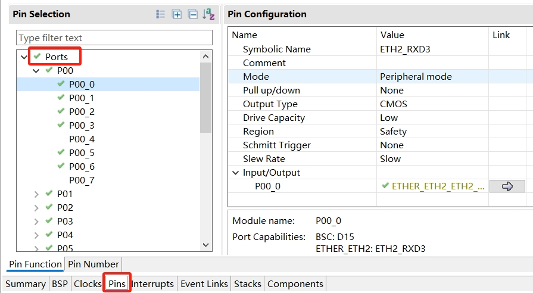
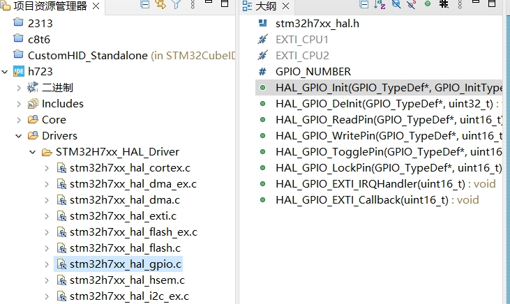

十、e2studio VS STM32CubeIDE之pin配置对比 
===
[TOC]

# 一、概述/目的
1、从点亮第一个led来对比pin配置功能的对比

# 二、pin配置对比表格

|功能对比|stm32cubeide|e2studio|
|:-:|:-:|:-:|
|工具|stm32cubemx|FSP configuration/RASC|
|可视化配置|Pinout view|FSP Visualization|
|独立外设配置|只有gpio配置|有独立pins页面|
|配置导出|导出.csv|导出.csv/.pinconfig|
|配置导入|不支持|可导入/合并|
|多套配置|不支持|支持多套|
|gpio功能 (与具体芯片有关)|别名 输入上下拉 输出推挽开漏 速度等|别名 输入上下拉 输出推挽开漏 驱动能力等|
|初始化函数|MX_GPIO_Init(void) (HAL_GPIO_WritePin(GPIOH, GPIO_PIN_0, GPIO_PIN_RESET) HAL_GPIO_Init(GPIOA, &GPIO_InitStruct))|R_IOPORT_Open (&g_ioport_ctrl, g_ioport.p_cfg)|
|API|init/write/read/toggle等|R_IOPORT/R_BSP_Pin等|
||||

# 三、pin配置对比图片

