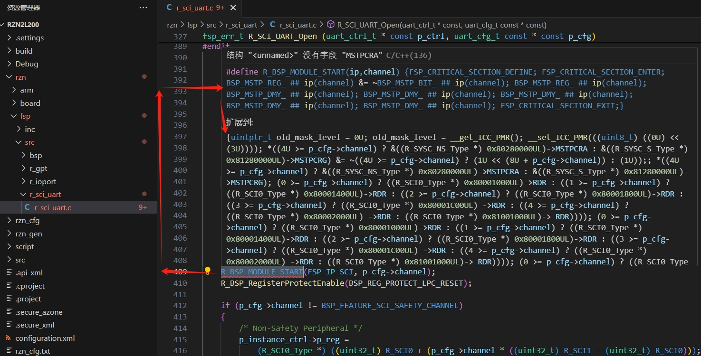

十一、e2studio VS STM32CubeIDE之宏函数展开 
===
[TOC]

# 一、概述/目的
- 复杂宏函数如何快速展开
  
# 二、复杂宏函数举例

```
#define R_BSP_MODULE_START(ip, channel)            {FSP_CRITICAL_SECTION_DEFINE;                                   \
                                                    FSP_CRITICAL_SECTION_ENTER;                                    \
                                                    BSP_MSTP_REG_ ## ip(channel) &= ~BSP_MSTP_BIT_ ## ip(channel); \
                                                    BSP_MSTP_REG_ ## ip(channel);                                  \
                                                    BSP_MSTP_DMY_ ## ip(channel);                                  \
                                                    BSP_MSTP_DMY_ ## ip(channel);                                  \
                                                    BSP_MSTP_DMY_ ## ip(channel);                                  \
                                                    BSP_MSTP_DMY_ ## ip(channel);                                  \
                                                    BSP_MSTP_DMY_ ## ip(channel);                                  \
                                                    FSP_CRITICAL_SECTION_EXIT;}
 ```

# 三、编译-预处理
[嵌入式科普(21)c代码究竟是如何一步步运行的之编译](https://mp.weixin.qq.com/s?__biz=MzkxNDQyMTU4Mg==&mid=2247485188&idx=1&sn=cb933568c11d077905639ff28ec38836&chksm=c16fe525f6186c3393ce244b67e6d86c55c2eb7289ff233ba89d58948cd6519f855a68b6f559&token=1064814056&lang=zh_CN#rd)

三、编译的过程
3.1 linux gcc hello.c -o hello
预处理（生成预处理后的文件）：
虽然 GCC 没有直接输出预处理后文件的选项，但你可以通过重定向输出到一个文件来查看预处理后的内容。
```
gcc -E hello.c -o hello.i
```
-E 选项告诉 GCC 只进行预处理并停止。

**在stm32cubeide、e2studio中如何预处理？**

# 四、stm32cubeide和e2studio的预处理
- stm32cubeide


- e2studio


# 五、source insight和vscode



- 对比结果不用多说