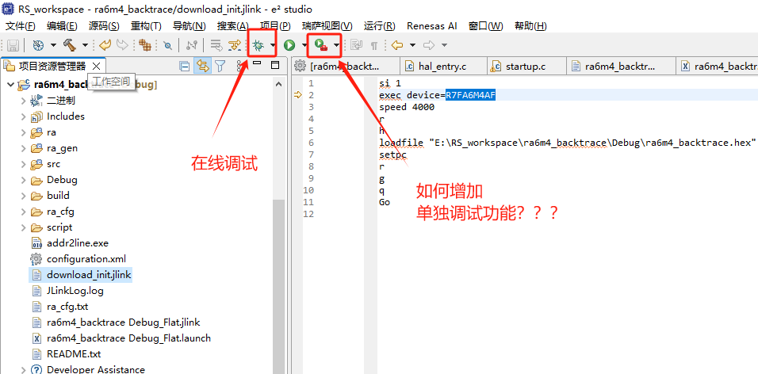

十三、e2studio VS STM32CubeIDE之"单独下载"程序
===
[toc]

# 一、概述
- 开发中需要频繁的下载程序，"在线调试"比"单独下载"时间长很多，单独下载可以提高工作效率
- keil、iar、stm32cubeide、rt-thread studio都自带"在线调试"和"单独下载"两个按钮
- 如何让e2studio增加单独下载按钮--->外部工具调用jlink

# 二、参考资料
- 参考rt-thread studio"单独下载"功能请实现e2studio增加"单独下载"按钮
- https://blog.csdn.net/qq_29246181/article/details/119427857

# 三、各家IDE的"在线调试"和"单独下载"按钮





# 四、e2studio增加"单独下载"按钮
## 4.1 新建外部工具

位置：
```
C:\Program Files (x86)\SEGGER\JLink_V782\JLink.exe
```
工作目录：
```
${project_loc}
```
自变量：
```
-device R7FA6M4AF -ExitOnError -CommanderScript download_init.jlink
```


## 4.2 增加.jlink脚本

download_init.jlink 放在工程根目录下
```
si 1
exec device=R7FA6M4AF
speed 4000
r
h
loadfile "E:\RS_workspace\ra6m4_backtrace\Debug\ra6m4_backtrace.hex" 
setpc 
r
g
q
Go
```

## 4.3 增加外部工具---"单独下载"按钮


### 4.3.1 增加前进后退按钮


## 4.4 增加"单独下载"按钮快捷键


## 4.5 测试"单独下载"按钮效果
- 必须提示segger下载窗口


- 控制台日志

```
SEGGER J-Link Commander V7.82 (Compiled Oct 13 2022 13:34:15)
DLL version V7.82, compiled Oct 13 2022 13:32:51

J-Link Commander will now exit on Error

J-Link Command File read successfully.
Processing script file...
J-Link>si 1
J-Link connection not established yet but required for command.
Connecting to J-Link via USB...O.K.
Firmware: J-Link OB-S124 compiled Jul  3 2024 17:03:07
Hardware version: V1.00
J-Link uptime (since boot): 0d 01h 38m 26s
S/N: 831467091
USB speed mode: Full speed (12 MBit/s)
VTref=3.300V
Selecting SWD as current target interface.
J-Link>exec device=R7FA6M4AF
Device "R7FA6M4AF" selected.
J-Link>speed 4000
Selecting 4000 kHz as target interface speed
J-Link>r
Target connection not established yet but required for command.
Device "R7FA6M4AF" selected.


Connecting to target via SWD
ConfigTargetSettings() start
Configuring FlashDLNoRMWThreshold=0x200 in order to make sure that option bytes programming is done via read-modify-write
ConfigTargetSettings() end
InitTarget() start
Determining TrustZone configuration...
  Secure Debug: Enabled (SSD)
Determining currently configured transfer type by reading the AHB-AP CSW register.
  --> Correct transfer type configured. Done.
InitTarget() end
Found SW-DP with ID 0x6BA02477
DPIDR: 0x6BA02477
CoreSight SoC-400 or earlier
Scanning AP map to find all available APs
AP[2]: Stopped AP scan as end of AP map has been reached
AP[0]: AHB-AP (IDR: 0x84770001)
AP[1]: APB-AP (IDR: 0x54770002)
Iterating through AP map to find AHB-AP to use
AP[0]: Core found
AP[0]: AHB-AP ROM base: 0xE00FE000
CPUID register: 0x410FD214. Implementer code: 0x41 (ARM)
Feature set: Mainline
Found Cortex-M33 r0p4, Little endian.
FPUnit: 8 code (BP) slots and 0 literal slots
Security extension: implemented
Secure debug: enabled
CoreSight components:
ROMTbl[0] @ E00FE000
[0][0]: E0044000 CID B105900D PID 005BB906 DEVARCH 00000000 DEVTYPE 14 CTI (?)
[0][1]: E0047000 CID B105900D PID 003BB908 DEVARCH 00000000 DEVTYPE 12 CSTF
[0][2]: E0048000 CID B105900D PID 001BB961 DEVARCH 00000000 DEVTYPE 21 ETB
[0][3]: E0049000 CID B105F00D PID 001BB101 TSG
[0][4]: E0040000 CID B105900D PID 000BBD21 DEVARCH 00000000 DEVTYPE 11 TPIU
[0][5]: E00FF000 CID B105100D PID 000BB4C9 ROM Table
ROMTbl[1] @ E00FF000
[1][0]: E000E000 CID B105900D PID 000BBD21 DEVARCH 47702A04 DEVTYPE 00 Cortex-M33
[1][1]: E0001000 CID B105900D PID 000BBD21 DEVARCH 47701A02 DEVTYPE 00 DWT
[1][2]: E0002000 CID B105900D PID 000BBD21 DEVARCH 47701A03 DEVTYPE 00 FPB
[1][3]: E0000000 CID B105900D PID 000BBD21 DEVARCH 47701A01 DEVTYPE 43 ITM
[1][5]: E0041000 CID B105900D PID 002BBD21 DEVARCH 47724A13 DEVTYPE 13 ETM
[1][6]: E0042000 CID B105900D PID 000BBD21 DEVARCH 47701A14 DEVTYPE 14 CSS600-CTI
Cortex-M33 identified.
Reset delay: 0 ms
Reset type NORMAL: Resets core & peripherals via SYSRESETREQ & VECTRESET bit.
Reset: ARMv8M core with Security Extension enabled detected.
Reset: Halt core after reset via DEMCR.VC_CORERESET.
Reset: Reset device via AIRCR.SYSRESETREQ.
J-Link>h
PC = 000023D0, CycleCnt = 00000000
R0 = 00000000, R1 = 00000000, R2 = 00000000, R3 = 00000000
R4 = 00000000, R5 = 00000000, R6 = 00000000, R7 = 00000000
R8 = 20002B84, R9 = 0000001C, R10= 0440C080, R11= 00100315
R12= 0000000A
SP(R13)= 20002750, MSP= 20002750, PSP= 00000000, R14(LR) = FFFFFFFF
XPSR = F9000000: APSR = NZCVQ, EPSR = 01000000, IPSR = 000 (NoException)
CFBP = 00000000, CONTROL = 00, FAULTMASK = 00, BASEPRI = 00, PRIMASK = 00
MSPLIM = 00000000
PSPLIM = 00000000

Security extension regs:
MSP_S = 20002750, MSP_NS = 00000000
MSPLIM_S = 00000000, MSPLIM_NS = 00000000
PSP_S = 00000000, PSP_NS = 4F440408
PSPLIM_S = 00000000, PSPLIM_NS = 00000000
CONTROL_S  = 00, FAULTMASK_S  = 00, BASEPRI_S  = 00, PRIMASK_S  = 00
CONTROL_NS = 00, FAULTMASK_NS = 00, BASEPRI_NS = 00, PRIMASK_NS = 00

FPS0 = 00000000, FPS1 = 00000000, FPS2 = 00000000, FPS3 = 00000000
FPS4 = 00000000, FPS5 = 00000000, FPS6 = 00000000, FPS7 = 00000000
FPS8 = 00000000, FPS9 = 00000000, FPS10= 00000000, FPS11= 00000000
FPS12= 00000000, FPS13= 00000000, FPS14= 00000000, FPS15= 00000000
FPS16= 00000000, FPS17= 00000000, FPS18= 00000000, FPS19= 00000000
FPS20= 00000000, FPS21= 00000000, FPS22= 00000000, FPS23= 00000000
FPS24= 00000000, FPS25= 00000000, FPS26= 00000000, FPS27= 00000000
FPS28= 00000000, FPS29= 00000000, FPS30= 00000000, FPS31= 00000000
FPSCR= 00000000
J-Link>loadfile "E:\RS_workspace\ra6m4_backtrace\Debug\ra6m4_backtrace.hex" 
'loadfile': Performing implicit reset & halt of MCU.
Reset: ARMv8M core with Security Extension enabled detected.
Reset: Halt core after reset via DEMCR.VC_CORERESET.
Reset: Reset device via AIRCR.SYSRESETREQ.
Downloading file [E:\RS_workspace\ra6m4_backtrace\Debug\ra6m4_backtrace.hex]...
J-Link: Flash download: Bank 0 @ 0x0100A100: Skipped. Contents already match
J-Link: Flash download: Bank 1 @ 0x00000000: Skipped. Contents already match
O.K.
J-Link>setpc 
Syntax: SetPC <addr>

Script processing completed.


```


# 五、总结
- 通过e2studio（eclipse）外部工具调用jlink.exe，通过jlink指令下载
- e2studio默认未显示相关工具，需显示工具栏和设置快捷键