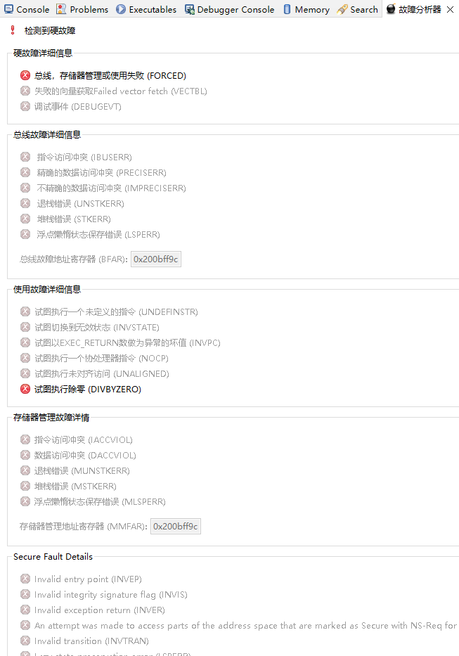
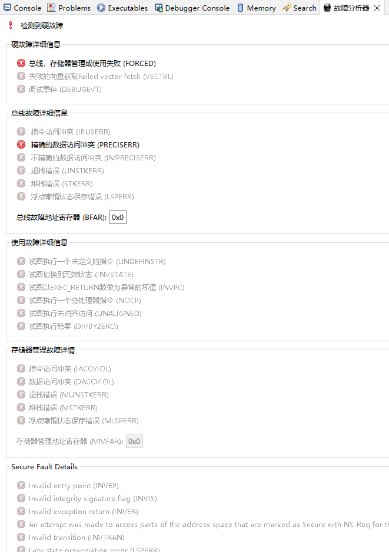
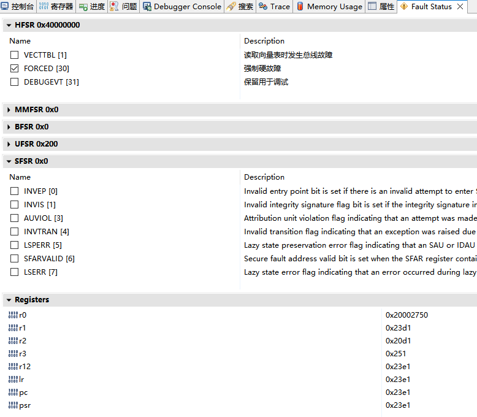
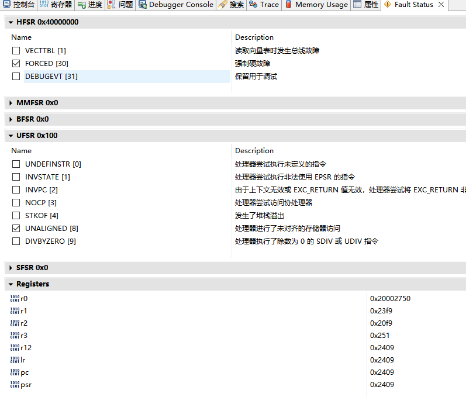

十五、e2studio VS STM32CubeIDE之hardfault分析窗口
===
[toc]

# 一、概述
- 之前分享来 [十二、e2studio VS STM32CubeIDE之栈回溯cmbacktrace](https://mp.weixin.qq.com/s/bfeMmFbRu0HMSX6uFE82UQ?token=837604299&lang=zh_CN) 可以离线追溯hardfault函数调用栈
- 现代IDE(e2studio、STM32CubeIDE)也提供了hardfault分析窗口功能
  

# 二、STM32CubeIDE故障分析器
- 除0错误
- 对齐错误

# 三、e2studio Fault Status
- 除0错误
- 对齐错误

# 四、总结
- 在线调试情况下，现代IDE的hardfault分析窗口可以非常便捷的分析定位