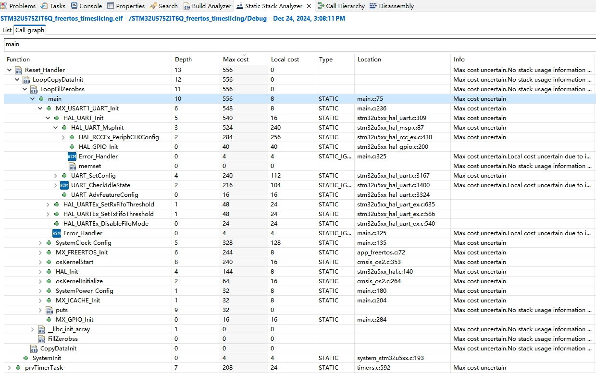

十六、e2studio VS STM32CubeIDE之"静态栈"分析窗口
===
[toc]

# 一、概述
- 在 [十二、e2studio VS STM32CubeIDE之栈回溯cmbacktrace](https://mp.weixin.qq.com/s/bfeMmFbRu0HMSX6uFE82UQ?token=1655026831&lang=zh_CN) 分享过“动态栈”分析
- 本文分享现代IDE的“静态栈”分析窗口功能

# 二、e2studio Stack Analysis

- 开启stack-usage
```
-fstack-usage -fdump-rt-pro_and_epilogue
```


- Stack Analysis窗口


- blinky_thread线程


- e2studio官网链接 
https://www.renesas.cn/zh/software-tool/e-studio


# 三、stm32cubeide static Stack Analyzer

- 默认开启stack-usage


- static Stack Analyzer窗口
  


- StartDefaultTask线程





- stm32cubeide官网链接 

https://www.st.com.cn/content/st_com/zh/stm32cubeide.html


- stm32cubeide用户手册


# 四、总结

- backtrace属于“动态栈”分析；现代IDE自带来“动态栈”分析
- “动态栈”分析来源.elf文件；-fstack-usage开启

- 其他的C/C++ 静态分析工具
  -  Clang Static Analyzer

        描述：Clang 编译器自带的静态分析工具，能够检测内存泄漏、空指针解引用等问题。

        使用方式：可以通过命令行或集成到 IDE 中使用。

        官网：https://clang-analyzer.llvm.org/

   - Cppcheck

        描述：一个开源的 C/C++ 静态分析工具，支持检测未定义行为、内存泄漏、数组越界等问题。

        使用方式：命令行工具，也可以集成到 IDE 中。

        官网：http://cppcheck.sourceforge.net/

  - PVS-Studio

    描述：一个商业的静态分析工具，专注于检测 C/C++ 代码中的错误和安全漏洞。

    使用方式：支持 Windows 和 Linux，可以集成到 Visual Studio、CLion 等 IDE 中。

    官网：https://pvs-studio.com/

  - Coverity

    描述：一个强大的商业静态分析工具，支持多种编程语言，包括 C/C++、Java 等。

    使用方式：通常用于企业级项目，支持持续集成。

    官网：https://www.synopsys.com/software-integrity/security-testing/static-analysis-sast.html