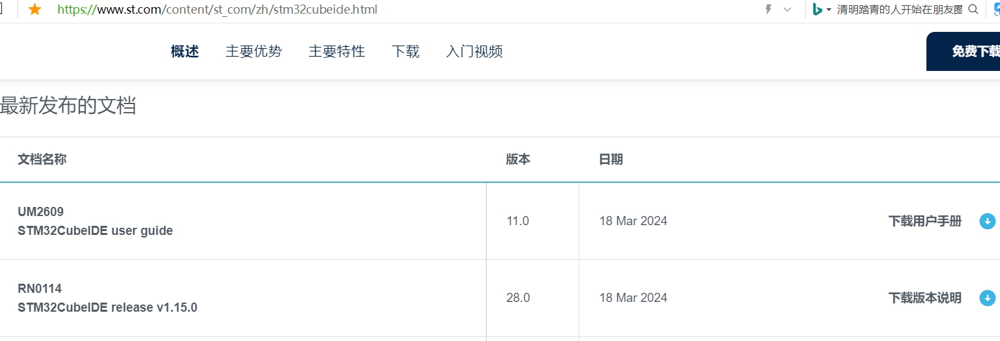
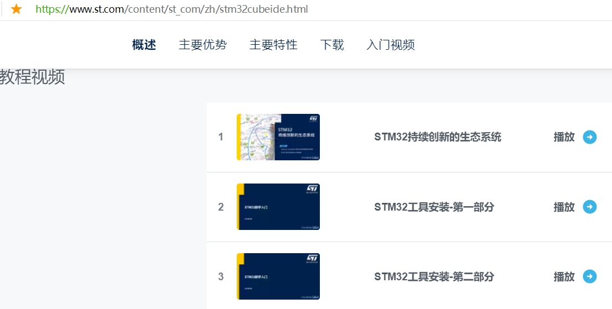
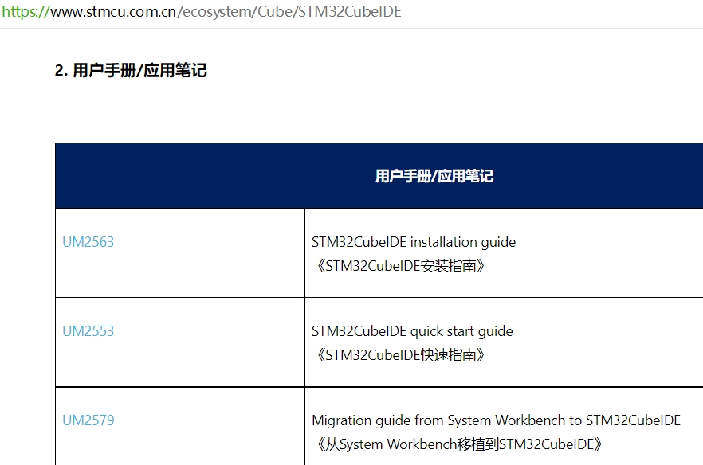
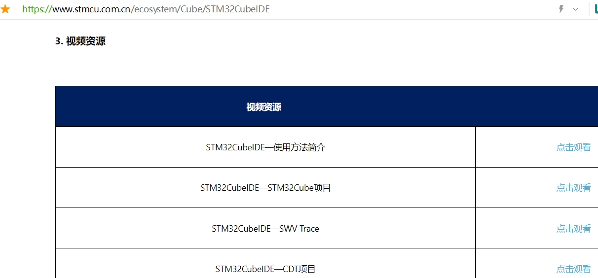
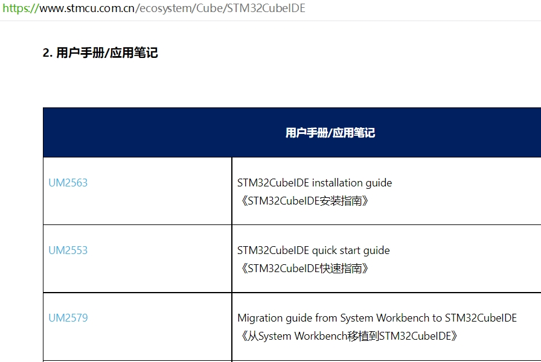
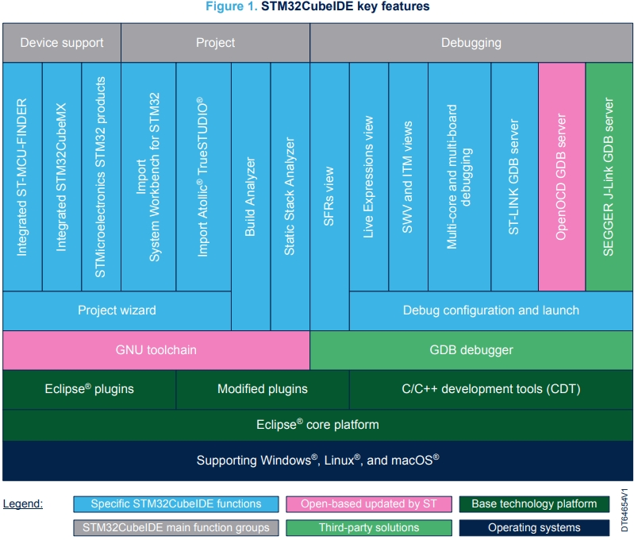
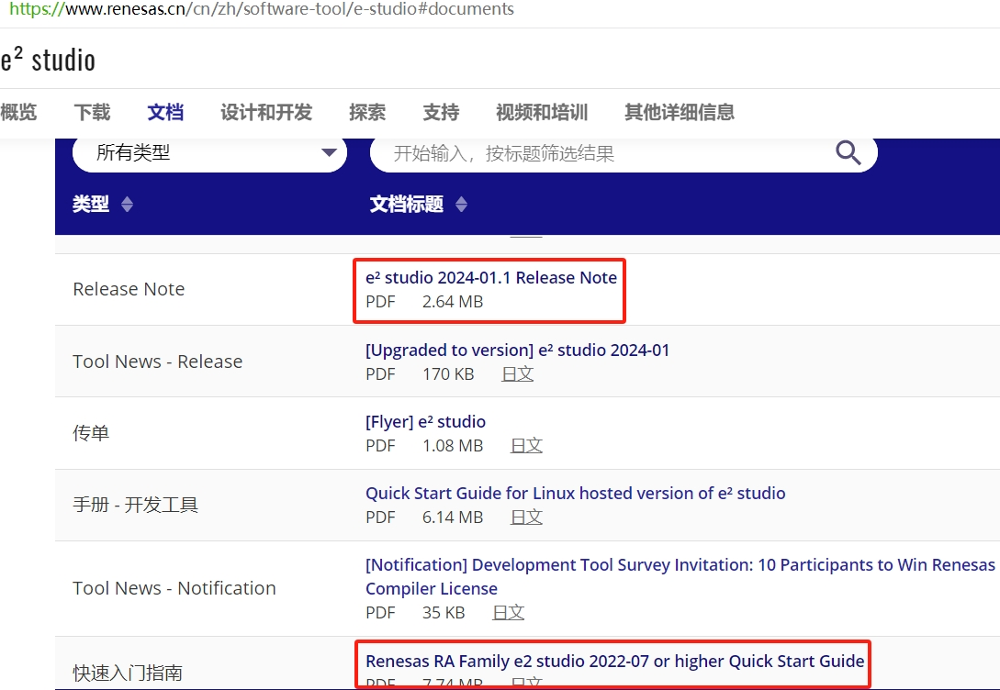
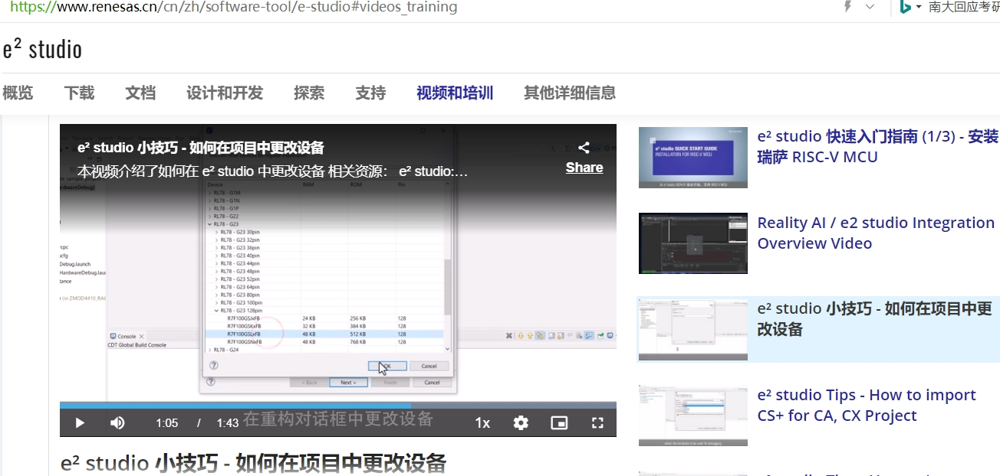
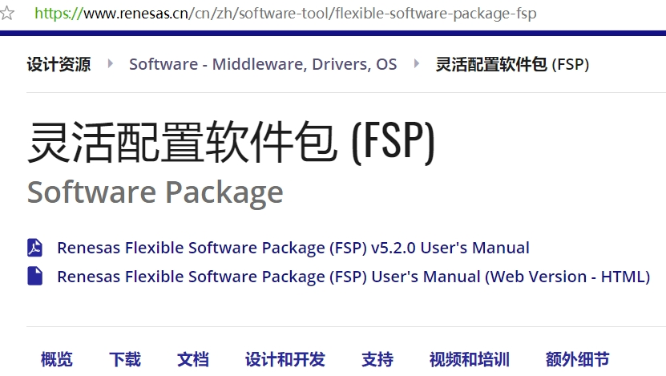
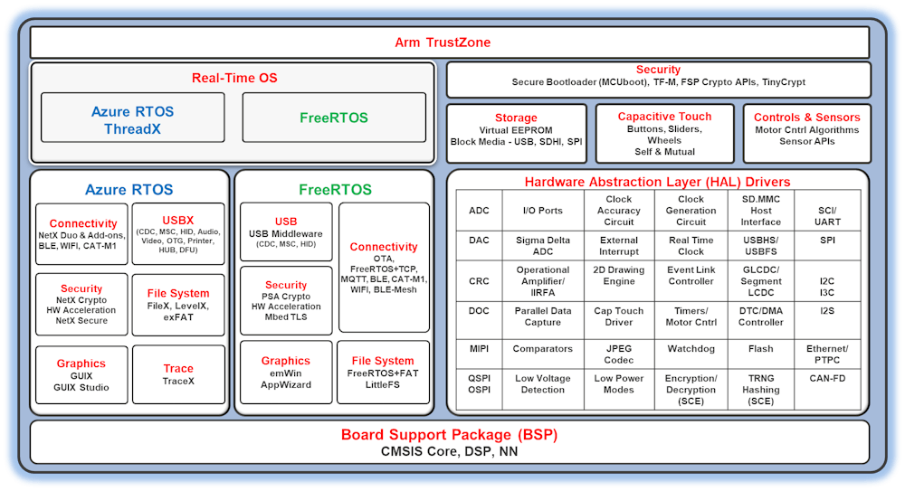

**二、e2studio VS STM32CubeIDE之功能对比**

[TOC]

# 一、概述/目的
- 通过对比学习，更快速的掌握两款IDE

# 二、官网资料
## 2.1 stm32cubeide
- https://www.stmcu.com.cn/ecosystem/Cube/STM32CubeIDE
- https://www.st.com/content/st_com/zh/stm32cubeide.html

## 2.2 e2studio
- https://www.renesas.cn/cn/zh/software-tool/e-studio
- https://www.renesas.cn/cn/zh/software-tool/flexible-software-package-fsp#overview
 
 
 
 

# 三、功能对比
- 汉化
- 自动补全
- 中文编码
- 内存使用细节
- 在线更新库
- 例程下载和导入
- 时钟树的重置和自动
- 芯片选项和变更
- 线程安全
- 代码分层
- 实例化
- 固件大小
- 单下载
- 变量和寄存器刷新
- 生成烧录文件
  
 

