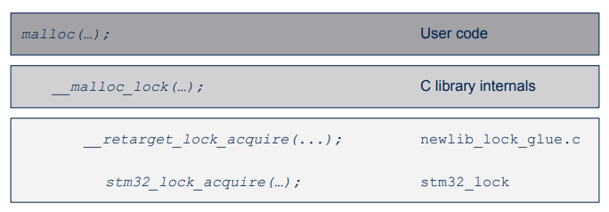
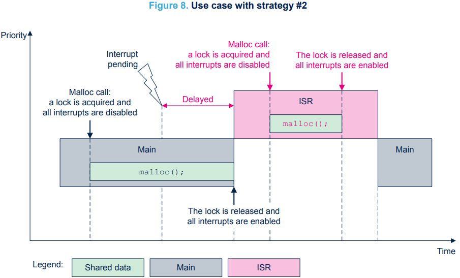
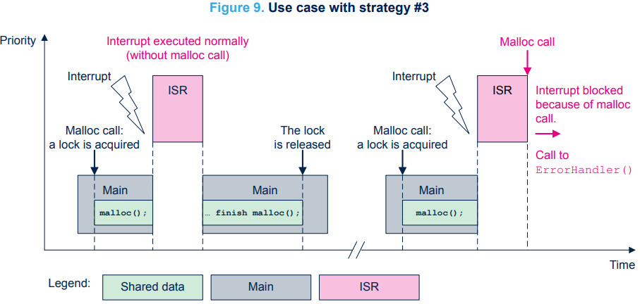
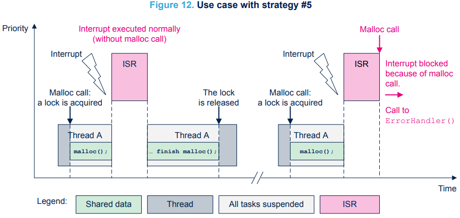

**四、e2studio VS STM32CubeIDE之STM32CubeIDE线程安全解决方案**

[TOC]

# 一、概述/目的
- 继续[**嵌入式科普(6)你听说过FreeRTOS heap6吗？**]话题分享
- 介绍STM32CubeMX和STM32CubeIDE实现的线程[**安全解决方案**]
- 同时强调线程安全的[**重要性**]：裸机和RTOS都可能存在；MDK、 EWARM、STM32CubeIDE都可能存在
- [**资料来源**]：AN5731:STM32CubeMX and STM32CubeIDE thread-safe solution:
[https://www.st.com/content/ccc/resource/technical/document/application_note/group2/de/c7/d1/5c/ca/34/4c/bc/DM00826986/files/DM00826986.pdf/jcr:content/translations/en.DM00826986.pdf](./https://www.st.com/content/ccc/resource/technical/document/application_note/group2/de/c7/d1/5c/ca/34/4c/bc/DM00826986/files/DM00826986.pdf/jcr:content/translations/en.DM00826986.pdf)

# 二、原因和办法
- **线程安全问题的根本原因**在于多个线程同时访问共享数据时可能导致数据不一致，
- **处理办法是**使用同步机制（如互斥锁、信号量）确保在同一时刻只有一个线程可以访问共享数据


# 三、线程安全问题的描述
- RTOS应用：RTOS中的两个线程或任务或一个中断服务例程（ISR） 
- 裸机应用：主线程被ISR中断，这也被视为第二个执行线程 
- malloc()、free()、printf()、strtok()....
- usb class、网络编程、算法....
- 链表....


# 四、STM32解决方案
- **c库重定向**

- stm32_lock.h、newlib_lock_glue.c（dlib_lock_glue
.c、armlib_lock_glue.c）、stm32_lock_user.h
- 4中策略5个设定

## 4.1 通用策略
- 通用策略#1：自定义实现。
    如果在STM32CubeMX中禁用了FreeRTOS™，则会自动选择策略#2。
    如果在STM32CubeMX中启用了FreeRTOS™，则会自动选择策略#4。
- 通用策略#2：允许从中断中使用锁。
- 通用策略#3：拒绝对中断使用锁。

## 4.2 RTOS策略
- FreeRTOS策略#4：允许来自中断的锁使用。
- FreeRTOS策略#5：拒绝来自中断的锁使用。


## 4.3 策略的讲解
### 4.3.1 裸机应用(策略2、3)



### 4.3.2 RTOS应用(策略4、5)
.png)
.png)


# 五、关键源码
[The Red Hat newlib C Library:
https://sourceware.org/newlib/libc.html](./https://sourceware.org/newlib/libc.html)

```
#elif STM32_THREAD_SAFE_STRATEGY == 2
/*
 * Allow lock usage from interrupts.
 */

/* Private defines ---------------------------------------------------------*/
/** Initialize members in instance of <code>LockingData_t</code> structure */
#define LOCKING_DATA_INIT { 0, 0 }

/* Private typedef ---------------------------------------------------------*/
typedef struct
{
  uint8_t flag; /**< Backup of PRIMASK.PM at nesting level 0 */
  uint8_t counter; /**< Nesting level */
} LockingData_t;

/* Private functions -------------------------------------------------------*/

/**
  * @brief Initialize STM32 lock
  * @param lock The lock to init
  */
static inline void stm32_lock_init(LockingData_t *lock)
{
  STM32_LOCK_BLOCK_IF_NULL_ARGUMENT(lock);
  lock->flag = 0;
  lock->counter = 0;
}

/**
  * @brief Acquire STM32 lock
  * @param lock The lock to acquire
  */
static inline void stm32_lock_acquire(LockingData_t *lock)
{
  uint8_t flag = (uint8_t)(__get_PRIMASK() & 0x1); /* PRIMASK.PM */
  __disable_irq();
  __DSB();
  __ISB();
  STM32_LOCK_BLOCK_IF_NULL_ARGUMENT(lock);
  if (lock->counter == 0)
  {
    lock->flag = flag;
  }
  else if (lock->counter == UINT8_MAX)
  {
    STM32_LOCK_BLOCK();
  }
  lock->counter++;
}

/**
  * @brief Release STM32 lock
  * @param lock The lock to release
  */
static inline void stm32_lock_release(LockingData_t *lock)
{
  STM32_LOCK_BLOCK_IF_NULL_ARGUMENT(lock);
  if (lock->counter == 0)
  {
    STM32_LOCK_BLOCK();
  }
  lock->counter--;
  if (lock->counter == 0 && lock->flag == 0)
  {
    __enable_irq();
  }
}
```