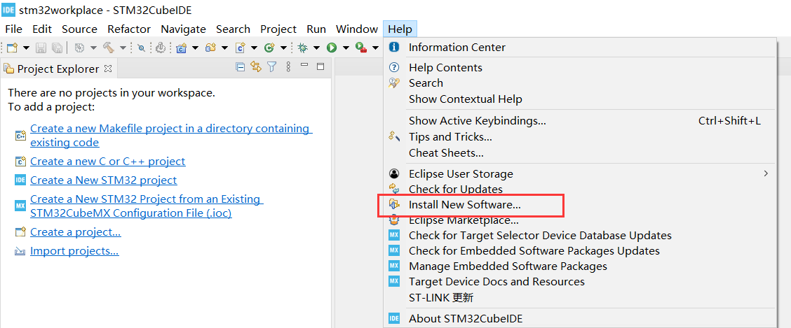
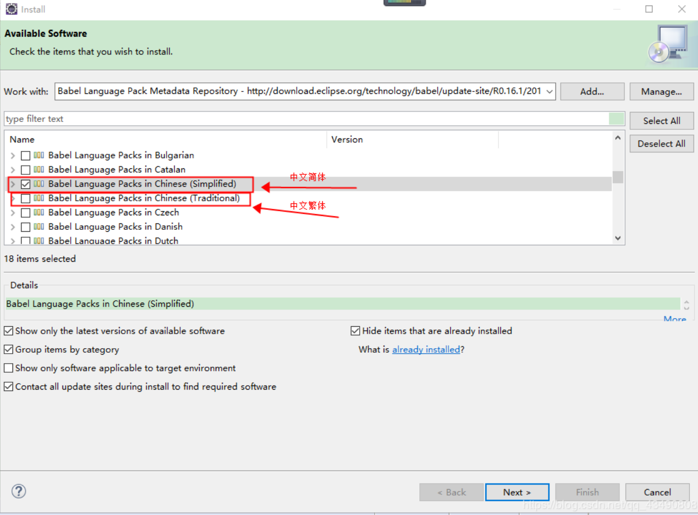
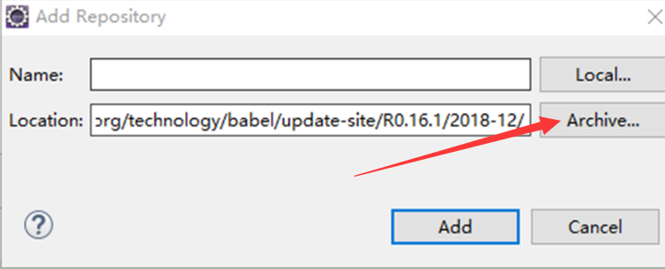
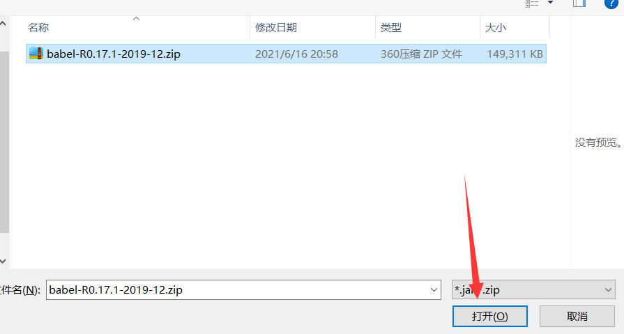
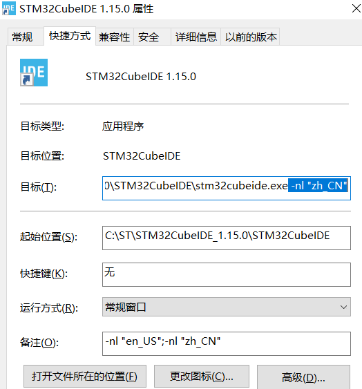
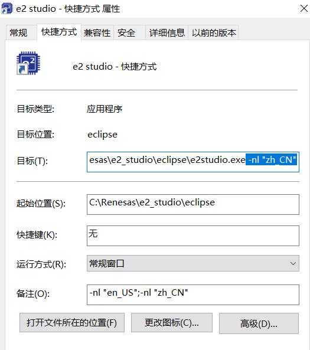

**五、e2studio VS STM32CubeIDE之汉化**

[TOC]

# 一、概述/目的
- 介绍stm32cubeide汉化方案和汉化包
- e2studio自带汉化包，在安装过程中可选择安装
- e2studio STM32CubeIDE切换中英文

# 二、stm32cubeide汉化
- stm32cubeide汉化就是**eclipse的汉化**
- CSDN:[https://blog.csdn.net/m0_46681107/article/details/119478800](https://blog.csdn.net/m0_46681107/article/details/119478800)
## 2.1 在线下载安装汉化插件
- 在线下载慢
- https://download.eclipse.org/technology/babel/update-site/R0.17.1/2019-12/

## 2.2 直接安装汉化包(推荐)
- 比在线快
- [babel-R0.17.1-2019-12.zip](./tool/babel-R0.17.1-2019-12.zip)
  

# 三、e2studio STM32CubeIDE中英文切换
- 目标增加“ -nl "zh_CN”：\stm32cubeide.exe -nl "zh_CN"
- 备注(为了记忆切换命令)：-nl "en_US";-nl "zh_CN"
  

