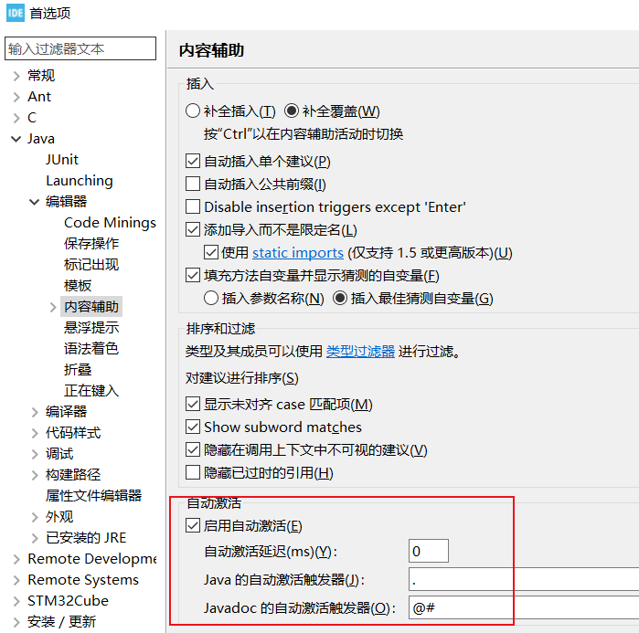

**六、e2studio VS STM32CubeIDE之代码自动补全**

[TOC]

# 一、概述/目的
- **eclipse系ide代码补全快捷键alt+/，java可以修改任意字母触发自动补全，但c/c++没有这个功能选项**
- 网上有提供自动补全插件，但只能用于低版本，不通用(不将就)
- 介绍eclipse c/c++自动补全安装原理、教程、参考资料
- **个人测试eclipse c/++成功，但e2studio、STM32CubeIDE c/c++都失败**
- 有成功的请留言指导

# 二、eclipse c/c++自动补全

## 2.1 修改实现原理
- 搜索“eclipse cdt 代码自动补全”有很多文章介绍
- eclipse c/c++自动补全是CDT插件的功能，但有缺陷
- 所以使用eclipse Java的原理去修改c/c++ 插件cdt.ui的代码
  

## 2.2 修改插件cdt.ui的方法
### 2.2.1 资料来源
- 资料1：[Cube IDE 实现自动代码补全功能](https://blog.csdn.net/Wu_HuaJie/article/details/129213406)
- 资料2：[【Eclipse】Plug-in Development 插件的安装](https://blog.csdn.net/qq_39921135/article/details/133842682#:~:text=%E5%85%88%E6%8C%89%E8%B7%AF%E7%BA%BF%E6%89%BE%E5%88%B0%E9%9C%80%E8%A6%81%E7%9A%84%E9%A1%B5%E9%9D%A2%EF%BC%9Aeclipse%E2%80%93Window%E2%80%93Preferences%E2%80%93Java%E2%80%93Editor%E2%80%93Content%20Assist%20%E5%9C%A8Work%20with%E6%A1%86%E4%B8%AD%E8%BE%93%E5%85%A5%EF%BC%9A%20http%3A%2F%2Fdownload.eclipse.org%2Freleases%2F2019-06%20PS%EF%BC%9A%E5%90%8E%E9%9D%A2%E7%9A%842019-06%E6%98%AFeclipse%E5%8F%91%E8%A1%8C%E7%9A%84%E6%97%B6%E9%97%B4%20%E9%80%89%E6%8B%A9%EF%BC%9A%20General,%E4%B8%8B%E7%9A%84%20Eclipse%20Plug-in%20Develoment%20Environment%20%E7%82%B9%E5%87%BBnext-%3Efinish%E5%8D%B3%E5%8F%AF%E3%80%82%20%E6%AD%A4%E6%97%B6%E4%BE%BF%E5%8F%AF%E4%BB%A5%E5%9C%A8window-%3EShowView-%3EOther-%3EPlug-in%20Development-%3EPlug-ins%E6%89%BE%E5%88%B0%E9%80%89%E9%A1%B9%E3%80%82)
### 2.2.2 修改的主要流程或逻辑
- 安装CDT main->eclipse plug-in->
- 导入插件cdt ui为项目工程->
- 修改项目代码，增加java自动补全的逻辑->
- 导出插件cdt ui替换旧的->
- 重启ide
  
### 2.2.3 失败的原因
- 我测试安装eclipse c/++使用上述方法是成功的，但e2studio、STM32CubeIDE均报错
- 可能是e2studio、STM32CubeIDE并非单独使用cdt ui；有其他依赖插件；有厂家的特殊修改
- 请大佬解答
  
# 三、呼吁st和Renesas厂家支持自动补全代码
- 难道你们不用自己的ide写代码吗？
- 能忍的了没有自动补全代码吗？