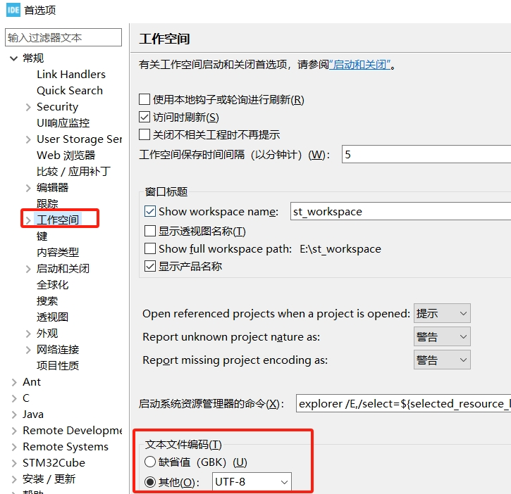
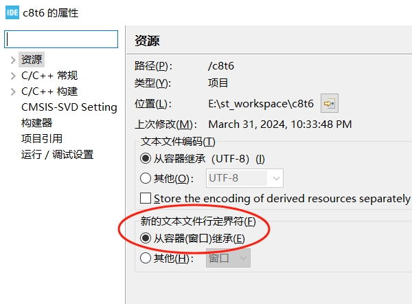
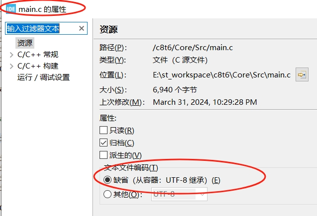
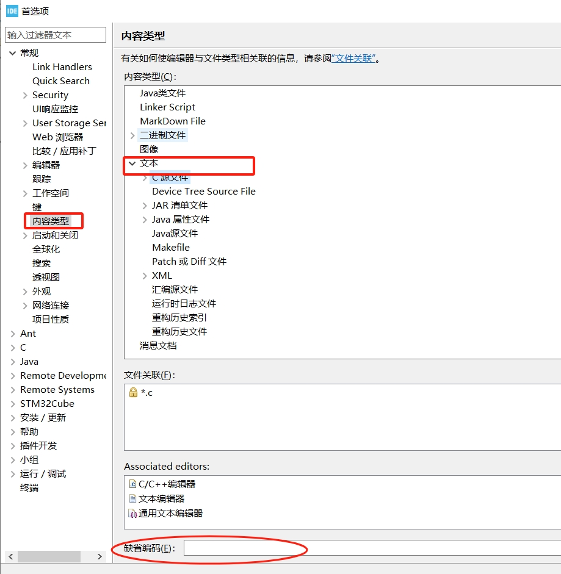

**七、e2studio VS STM32CubeIDE之显示中文编码**

[TOC]

# 一、概述/目的
- 使用不同工具查看代码，尤其涉及中文时候，可能出现乱码显示。例如：使用sourceinsight等查看代码，再用eclipse查看(或者反过来)，出现中文乱码。通常是中文编码不一致导致
- 介绍e2studio、STM32CubeIDE显示中文编码的设置方法
- 介绍eclipse中文编码设置的控制逻辑
- 个人推荐统一使用UTF8(xshell等默认UTF8，但sscom等默认gbk)

# 二、查看和修改文件编码
- 在状态栏查看文件编码格式（文本文档、notepad++、sourceinsight、vscode均有）
- 修改编码格式(另存为、编码选择)
  

# 三、eclipse编码格式
## 3.1 优先级
1、2、3逐级继承，在工具可设置的范围内4优先级是最高的，即如果设置了某类型文件的content type的default encoding，那编辑器会优先根据该类型文件设置的默认编码格式来编辑文件，而不管前面的1、2的设置。
### 3.1.1 全局workspace
- （windows->reference->General->workspace）

### 3.1.2 工程
- （project->property->resource）

### 3.1.3 文件
- （选中文件右键property->resource）
  可看到当前编辑器所使用的encoding type，这里可以直接更改编辑器编辑该文件时采用的encoding type并直接生效。

### 3.1.4 全局文件的content type
- （windows->reference->General->contest type->Default encoding）

# 二、STM32CubeIDE设置显示中文编码
- 相互继承的，所以直接修改整个工作空间的即可
  

# 二、e2studio设置显示中文编码
- 注意有工程未继承的，所以修改继承(推荐)或全局文件

