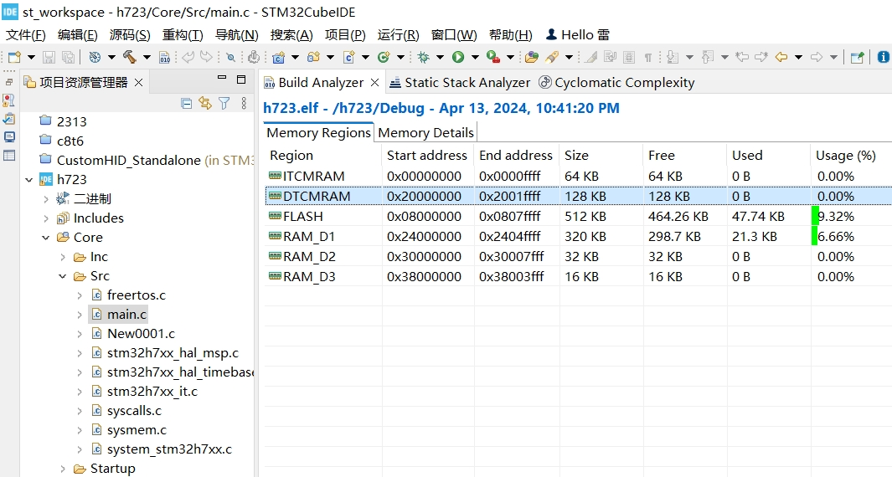
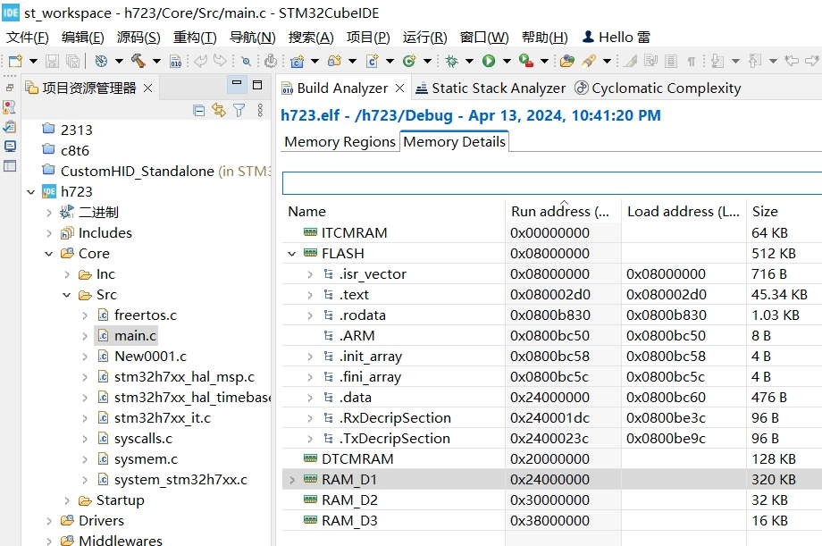
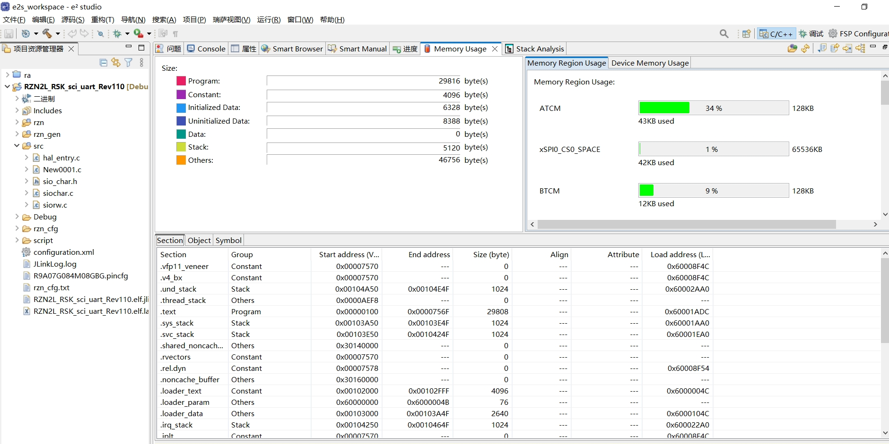
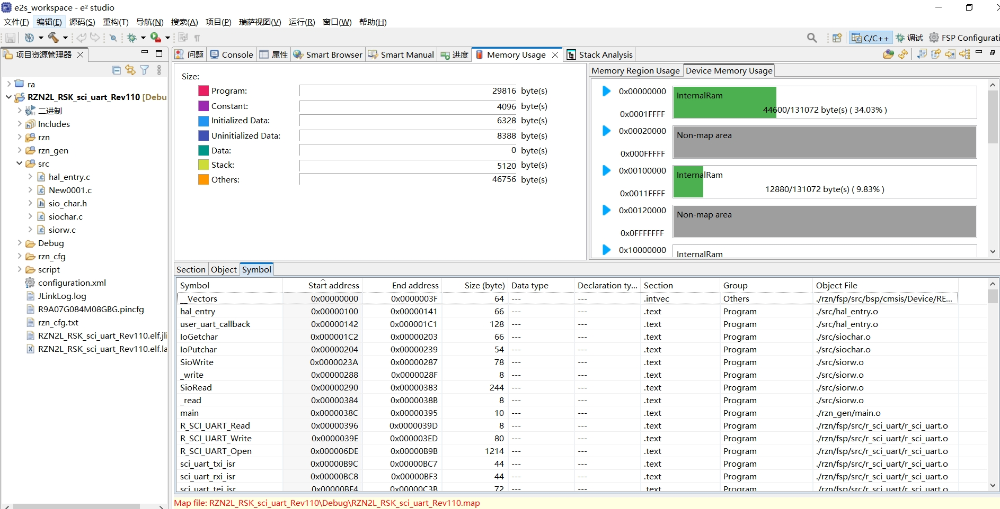

**八、e2studio VS STM32CubeIDE之内存使用情况窗口**

[TOC]

# 一、概述/目的
1、嵌入开发最大特点之一就是资源受限，关注芯片资源使用详情是优秀工程师的技能之一
2、Keil和IAR都不支持内存使用情况窗口，只能从map、list等文件查看
3、e2studio、STM32CubeIDE都支持内存使用情况窗口，非常清晰的查看内存使用
4、对此简介，起到抛砖引玉的作用

# 二、STM32CubeIDE Build Analyzer

# 三、e2studio Memory Usage
- 默认安装(lite)没有Memory Usage窗口
- 安装选择(full)全功能有Memory Usage的功能

